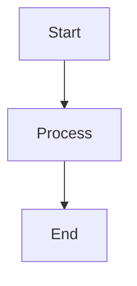

# MkDocs Documentation Setup

This repository includes a complete MkDocs setup with Material theme and Mermaid diagram support, automatically deployed to GitHub Pages via GitHub Actions.

## 🚀 Features

- **Material Theme**: Beautiful, responsive design with dark/light mode toggle
- **Mermaid Diagrams**: Create flowcharts, sequence diagrams, and more
- **Mathematical Expressions**: Support for LaTeX math expressions
- **Code Highlighting**: Syntax highlighting with copy buttons
- **Search**: Built-in search functionality
- **Git Integration**: Shows last modification dates
- **Auto Deployment**: Automatic deployment to GitHub Pages via GitHub Actions

## 📁 Project Structure

```
.
├── docs/                           # Documentation source files
│   ├── index.md                   # Homepage
│   ├── getting-started/           # Getting started guides
│   ├── mkdocs-guide/             # MkDocs and Material theme guides
│   ├── github-actions/           # GitHub Actions documentation
│   ├── stylesheets/              # Custom CSS
│   └── javascripts/              # Custom JavaScript
├── .github/workflows/
│   └── deploy-docs.yml           # GitHub Actions workflow for deployment
├── mkdocs.yml                    # MkDocs configuration
└── pyproject.toml               # Python dependencies (using uv)
```

## 🛠️ Local Development

### Prerequisites

- Python 3.9+
- [uv](https://docs.astral.sh/uv/) package manager

### Setup

1. **Install dependencies:**
   ```bash
   uv sync --group docs
   ```

2. **Serve locally:**
   ```bash
   uv run mkdocs serve
   ```

3. **Open your browser:**
   - Visit `http://127.0.0.1:8000`

### Build for Production

```bash
uv run mkdocs build
```

The generated site will be in the `site/` directory.

## 🔧 GitHub Pages Setup for Private Repository

Since this is a **private repository**, you need to configure GitHub Pages with special considerations:

### Step 1: Enable GitHub Pages

1. Go to your repository on GitHub
2. Navigate to **Settings** → **Pages**
3. Under **Source**, select **"GitHub Actions"** (not "Deploy from a branch")

### Step 2: Configure Repository Settings

1. In **Settings** → **General** → **Features**
2. Make sure **"Issues"** and **"Projects"** are enabled (required for Pages on private repos)

### Step 3: Set Repository Visibility for Pages

For **private repositories**, GitHub Pages has special requirements:

- **GitHub Pro/Team/Enterprise**: Pages can be private or public
- **GitHub Free**: Pages from private repos are always public

To make GitHub Pages private (Pro/Team/Enterprise only):
1. Go to **Settings** → **Pages**
2. Under **Visibility**, select **"Private"**

### Step 4: Verify Permissions

The GitHub Actions workflow needs these permissions (already configured in `deploy-docs.yml`):

```yaml
permissions:
  contents: read
  pages: write
  id-token: write
```

### Step 5: First Deployment

The workflow will automatically run when you:
- Push changes to the `main` branch affecting documentation files
- Manually trigger it from **Actions** tab → **Deploy Documentation** → **Run workflow**

## 🎨 Customization

### Colors and Theme

Edit `mkdocs.yml` to customize colors:

```yaml
theme:
  palette:
    primary: blue  # Change to your preferred color
    accent: indigo
```

### Custom CSS

Add custom styles in `docs/stylesheets/extra.css`:

```css
:root {
  --md-primary-fg-color: #your-color;
}
```

### Navigation

Update the navigation structure in `mkdocs.yml`:

```yaml
nav:
  - Home: index.md
  - Your Section:
    - Your Page: your-page.md
```

## 📝 Writing Documentation

### Creating New Pages

1. **Create a new `.md` file** in the `docs/` directory
2. **Add it to navigation** in `mkdocs.yml`
3. **Use Markdown** with Material extensions

### Mermaid Diagrams



### Code Blocks

```python title="example.py" linenums="1"
def hello_world():
    return "Hello, World!"
```

### Admonitions

!!! tip "Pro Tip"
    Use admonitions to highlight important information.

### Math Expressions

Inline: \\( E = mc^2 \\)

Block:
$$
\int_{-\infty}^{\infty} e^{-x^2} dx = \sqrt{\pi}
$$

## 🔄 Deployment Workflow

The GitHub Actions workflow (`.github/workflows/deploy-docs.yml`) automatically:

1. **Triggers on:**
   - Push to `main` branch (docs changes only)
   - Manual workflow dispatch

2. **Build process:**
   - Sets up Python and uv
   - Installs documentation dependencies
   - Validates MkDocs configuration
   - Builds the static site

3. **Deployment:**
   - Uploads site to GitHub Pages
   - Configures custom domain (if specified)

## 🚨 Troubleshooting

### Common Issues

1. **Workflow fails with permissions error:**
   - Check that GitHub Pages is set to "GitHub Actions" source
   - Verify repository settings allow Actions

2. **Site not updating:**
   - Check the Actions tab for workflow status
   - Ensure changes are pushed to `main` branch

3. **Mermaid diagrams not rendering:**
   - Verify the superfences configuration in `mkdocs.yml`
   - Check browser console for JavaScript errors

4. **Private repository pages are public:**
   - This is expected on GitHub Free
   - Upgrade to Pro/Team/Enterprise for private pages

### Getting Help

- Check the [MkDocs documentation](https://www.mkdocs.org/)
- Browse [Material for MkDocs documentation](https://squidfunk.github.io/mkdocs-material/)
- Review [GitHub Actions documentation](https://docs.github.com/en/actions)

## 📄 License

This documentation setup is provided as-is for learning purposes. Customize as needed for your project.

---

**Happy documenting!** 📚✨
