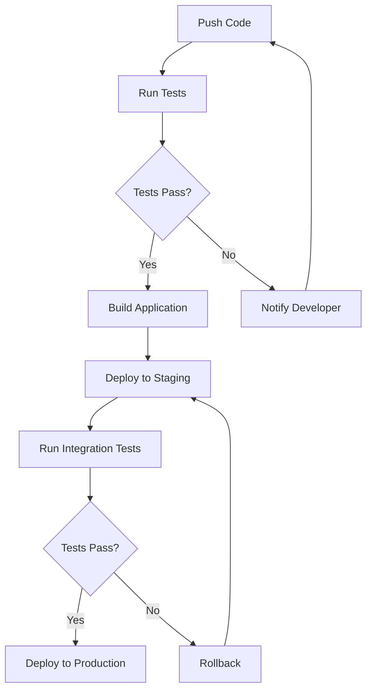
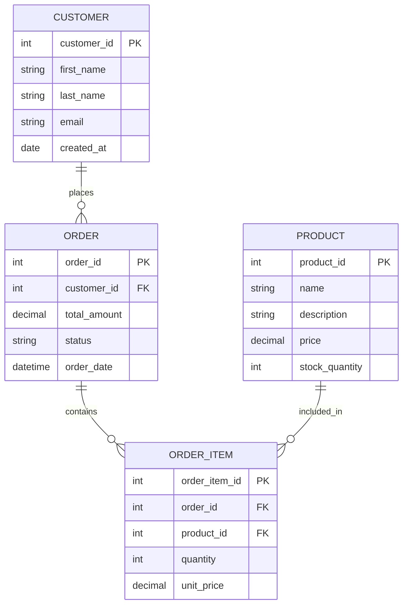
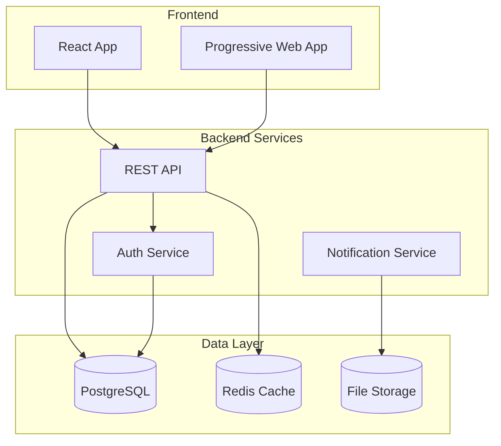

# Examples

This page demonstrates various features of MkDocs with Material theme and Mermaid diagrams.

## Code Examples

### Python

```python title="fibonacci.py" linenums="1"
def fibonacci(n):
    """Calculate the nth Fibonacci number."""
    if n <= 1:
        return n
    return fibonacci(n-1) + fibonacci(n-2)

# Example usage
for i in range(10):
    print(f"F({i}) = {fibonacci(i)}")
```

### JavaScript

```javascript title="api-client.js" linenums="1"
class ApiClient {
    constructor(baseUrl) {
        this.baseUrl = baseUrl;
    }
    
    async get(endpoint) {
        const response = await fetch(`${this.baseUrl}${endpoint}`);
        return response.json();
    }
    
    async post(endpoint, data) {
        const response = await fetch(`${this.baseUrl}${endpoint}`, {
            method: 'POST',
            headers: { 'Content-Type': 'application/json' },
            body: JSON.stringify(data)
        });
        return response.json();
    }
}
```

## Mermaid Examples

### CI/CD Pipeline



### Database Schema



### System Architecture



## Mathematical Expressions

### Inline Math

The quadratic formula is \\( x = \frac{-b \pm \sqrt{b^2-4ac}}{2a} \\).

### Display Math

$$
\int_{-\infty}^{\infty} e^{-x^2} dx = \sqrt{\pi}
$$

### Matrix

$$
\begin{pmatrix}
a & b \\
c & d
\end{pmatrix}
\begin{pmatrix}
x \\
y
\end{pmatrix}
=
\begin{pmatrix}
ax + by \\
cx + dy
\end{pmatrix}
$$

## Admonition Examples

!!! note "Note"
    This is a standard note admonition.

!!! abstract "Summary"
    This is an abstract admonition for summaries.

!!! info "Information"
    This provides additional information.

!!! tip "Pro Tip"
    This is a helpful tip for users.

!!! success "Success"
    This indicates a successful operation.

!!! question "Question"
    This poses a question to the reader.

!!! warning "Warning"
    This warns about potential issues.

!!! failure "Error"
    This indicates an error condition.

!!! danger "Danger"
    This warns about dangerous operations.

!!! bug "Known Issue"
    This documents a known bug.

!!! example "Example"
    This provides an example.

!!! quote "Quote"
    > "The best way to predict the future is to invent it."
    > 
    > — Alan Kay

## Content Tabs

=== "Development"
    ```yaml
    environment: development
    debug: true
    database:
      host: localhost
      port: 5432
      name: myapp_dev
    ```

=== "Staging"
    ```yaml
    environment: staging
    debug: false
    database:
      host: staging-db.example.com
      port: 5432
      name: myapp_staging
    ```

=== "Production"
    ```yaml
    environment: production
    debug: false
    database:
      host: prod-db.example.com
      port: 5432
      name: myapp_prod
    ```

## Tables

### Feature Comparison

| Feature | Free Plan | Pro Plan | Enterprise |
|---------|-----------|----------|------------|
| Users | 1 | 10 | Unlimited |
| Projects | 3 | 25 | Unlimited |
| Storage | 1GB | 10GB | 1TB |
| Support | Community | Email | 24/7 Phone |
| API Access | ❌ | ✅ | ✅ |
| Custom Domain | ❌ | ❌ | ✅ |

### Technical Specifications

| Component | Minimum | Recommended | Maximum |
|-----------|---------|-------------|---------|
| RAM | 4GB | 8GB | 32GB |
| CPU | 2 cores | 4 cores | 16 cores |
| Storage | 20GB SSD | 50GB SSD | 1TB SSD |
| Network | 10 Mbps | 100 Mbps | 1 Gbps |

## Task Lists

### Project Checklist

- [x] Set up development environment
- [x] Create project structure
- [x] Implement core features
- [ ] Write comprehensive tests
- [ ] Set up CI/CD pipeline
- [ ] Deploy to staging
- [ ] Conduct user testing
- [ ] Deploy to production
- [ ] Monitor performance
- [ ] Gather user feedback

### Documentation Tasks

- [x] Write installation guide
- [x] Create usage examples
- [x] Document API endpoints
- [ ] Record video tutorials
- [ ] Translate to other languages
- [ ] Create troubleshooting guide
