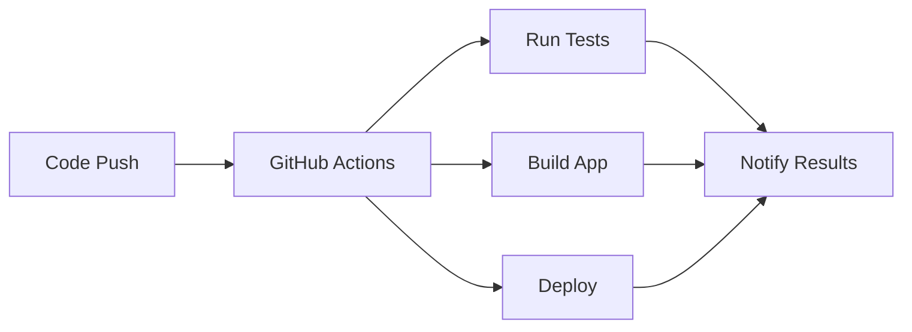

# GitHub Actions Introduction

GitHub Actions is a powerful CI/CD platform that allows you to automate your software development workflows directly in your GitHub repository.

## What are GitHub Actions?

GitHub Actions help you automate tasks within your software development life cycle. They are event-driven, meaning that you can run a series of commands after a specified event has occurred.



## Key Concepts

### Workflows

A workflow is a configurable automated process made up of one or more jobs. You create a workflow by adding a YAML file to your repository's `.github/workflows` directory.

```yaml title=".github/workflows/ci.yml"
name: CI Pipeline

on:
  push:
    branches: [ main ]
  pull_request:
    branches: [ main ]

jobs:
  test:
    runs-on: ubuntu-latest
    
    steps:
    - uses: actions/checkout@v4
    - name: Run tests
      run: npm test
```

### Events

Events are specific activities that trigger a workflow run. Common events include:

- **Push**: When code is pushed to a repository
- **Pull Request**: When a pull request is opened, synchronized, or closed
- **Schedule**: Run workflows on a schedule using cron syntax
- **Manual**: Manually trigger workflows with `workflow_dispatch`

### Jobs

A job is a set of steps that execute on the same runner. By default, jobs run in parallel, but you can configure dependencies between jobs.

### Steps

A step is an individual task that can run commands or actions. Steps within a job execute sequentially on the same runner.

### Actions

Actions are reusable units of code that can be used in workflows. You can create your own actions or use actions from the GitHub Marketplace.

## Common Use Cases

### Continuous Integration

```yaml
name: CI

on: [push, pull_request]

jobs:
  test:
    runs-on: ubuntu-latest
    
    steps:
    - uses: actions/checkout@v4
    - uses: actions/setup-node@v4
      with:
        node-version: '18'
    - run: npm ci
    - run: npm test
    - run: npm run build
```

### Continuous Deployment

```yaml
name: Deploy

on:
  push:
    branches: [ main ]

jobs:
  deploy:
    runs-on: ubuntu-latest
    
    steps:
    - uses: actions/checkout@v4
    - name: Deploy to production
      run: |
        echo "Deploying to production..."
        # Add deployment commands here
```

### Documentation Deployment

This repository uses GitHub Actions to automatically deploy this MkDocs documentation to GitHub Pages whenever changes are made to the documentation files.

## Runner Types

### GitHub-hosted Runners

- **ubuntu-latest**: Ubuntu Linux
- **windows-latest**: Windows Server
- **macos-latest**: macOS

### Self-hosted Runners

You can host your own runners for more control over the hardware, operating system, and tools.

## Security Considerations

!!! warning "Security Best Practices"
    - Never commit secrets to your repository
    - Use GitHub Secrets to store sensitive information
    - Limit permissions with `permissions` in workflows
    - Be cautious with third-party actions

!!! tip "Using Secrets"
    ```yaml
    steps:
    - name: Deploy
      env:
        API_KEY: ${{ secrets.API_KEY }}
      run: echo "Deploying with API key"
    ```

## Marketplace Actions

The GitHub Actions Marketplace provides thousands of pre-built actions:

- **actions/checkout**: Check out repository code
- **actions/setup-node**: Set up Node.js environment  
- **actions/upload-artifact**: Upload build artifacts
- **actions/download-artifact**: Download build artifacts

## Workflow Syntax

### Basic Structure

```yaml
name: Workflow Name

on:
  # Events that trigger the workflow

env:
  # Environment variables

jobs:
  job-name:
    runs-on: ubuntu-latest
    
    steps:
    - name: Step name
      run: command
```

### Conditional Execution

```yaml
steps:
- name: Run only on main branch
  if: github.ref == 'refs/heads/main'
  run: echo "This runs only on main"

- name: Run on success
  if: success()
  run: echo "Previous steps succeeded"
```

### Matrix Builds

```yaml
strategy:
  matrix:
    os: [ubuntu-latest, windows-latest, macos-latest]
    node-version: [16, 18, 20]

runs-on: ${{ matrix.os }}

steps:
- uses: actions/setup-node@v4
  with:
    node-version: ${{ matrix.node-version }}
```

## Next Steps

- [Workflows](workflows.md): Deep dive into workflow configuration
- [Examples](../examples.md): See practical examples of GitHub Actions in use
- [GitHub Actions Documentation](https://docs.github.com/en/actions): Official documentation
