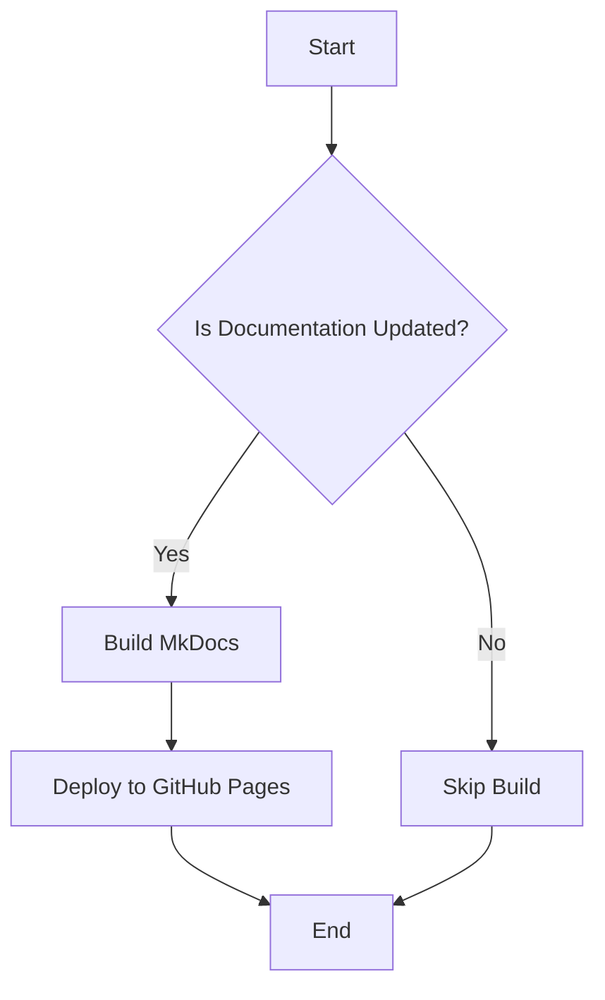

# Welcome to GitHub Actions Learning

Welcome to the **GitHub Actions Learning** documentation! This site demonstrates how to use MkDocs with the Material theme and Mermaid diagrams for creating beautiful documentation.

## 🚀 What You'll Find Here

This documentation covers:

- **Getting Started**: Installation and basic usage guides
- **MkDocs Guide**: Learn about Material theme features and Mermaid diagrams
- **GitHub Actions**: Understanding CI/CD workflows
- **Examples**: Practical examples and demonstrations

## 📊 Quick Example: Mermaid Diagram

Here's a simple workflow diagram to get you started:



## 🎯 Features Showcased

!!! tip "MkDocs Material Features"
    - [x] Dark/Light theme toggle
    - [x] Navigation tabs and sections
    - [x] Search functionality
    - [x] Code highlighting
    - [x] Mermaid diagram support
    - [x] Admonitions (like this one!)
    - [x] Git integration

## 💡 Quick Start

1. **Install Dependencies**
   ```bash
   pip install mkdocs-material mkdocs-git-revision-date-localized-plugin
   ```

2. **Serve Locally**
   ```bash
   mkdocs serve
   ```

3. **Build for Production**
   ```bash
   mkdocs build
   ```

## 📈 GitHub Actions Integration

This documentation is automatically deployed using GitHub Actions whenever changes are pushed to the main branch. The workflow handles:

- Building the MkDocs site
- Deploying to GitHub Pages (private repository compatible)
- Caching dependencies for faster builds

---

!!! info "About This Project"
    This is a learning repository for exploring GitHub Actions, MkDocs, and documentation best practices. Feel free to explore and experiment!
