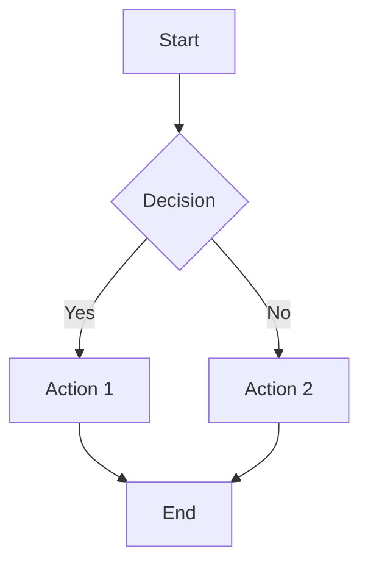
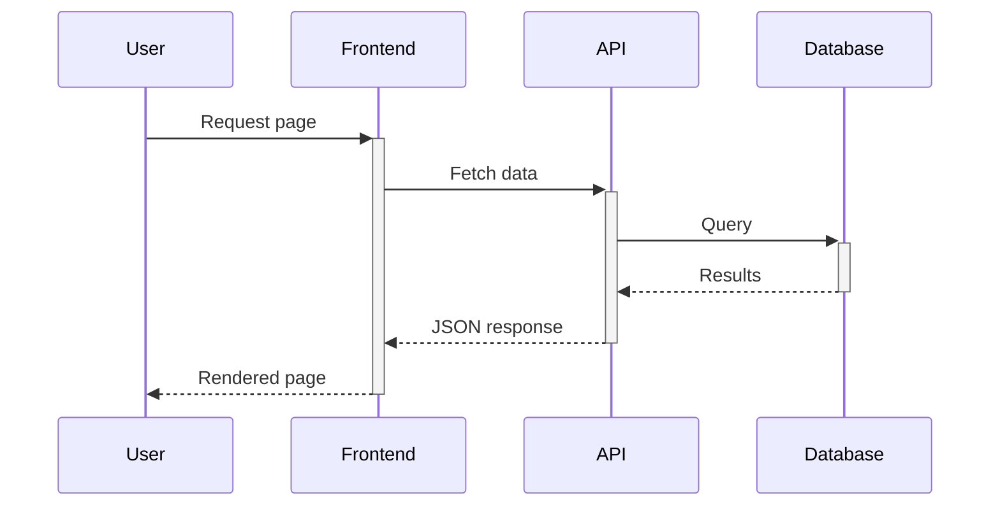
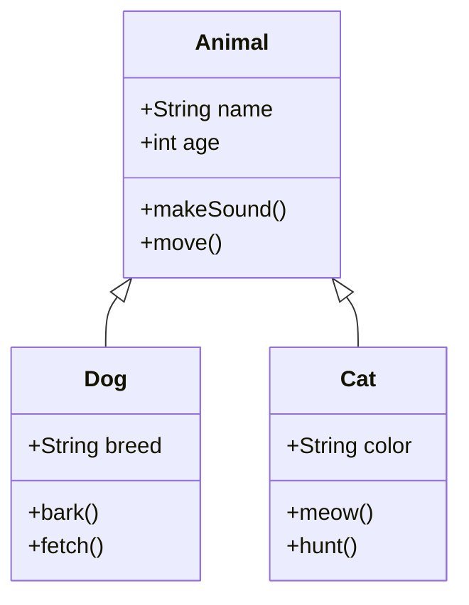
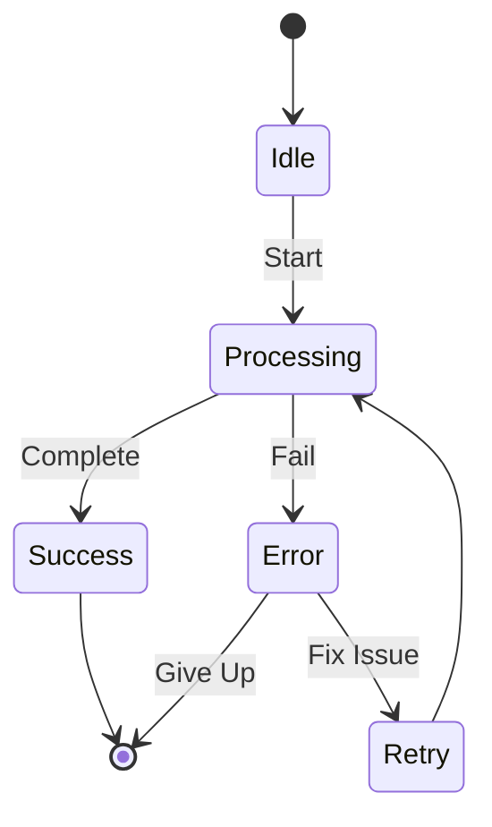
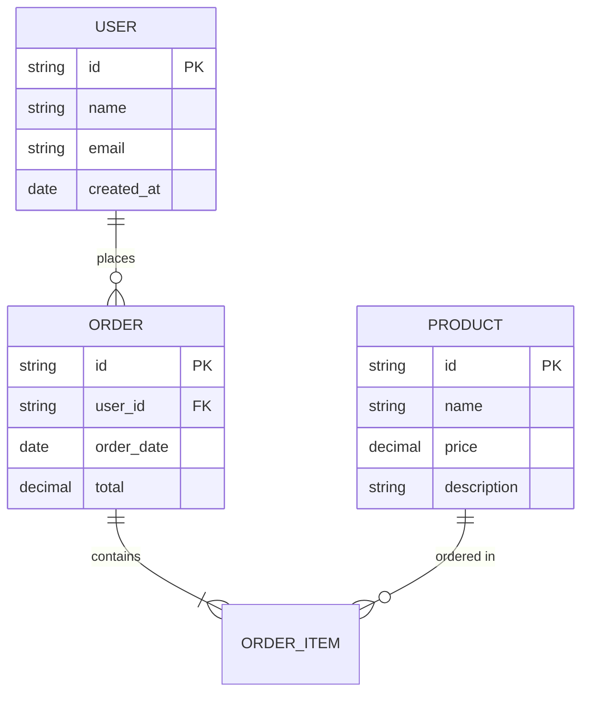
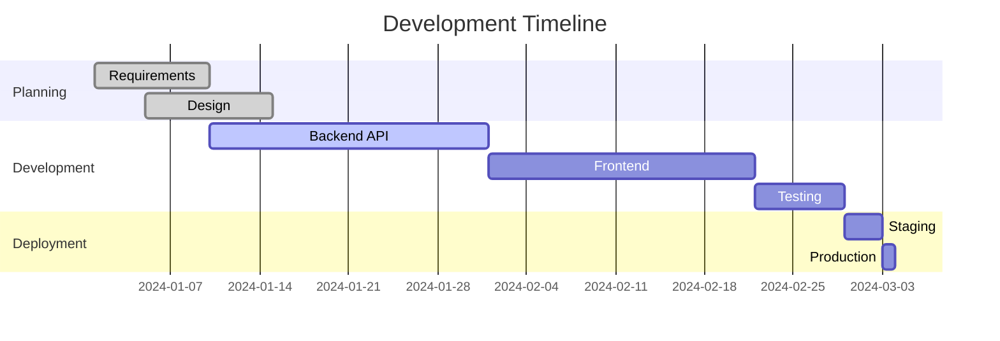
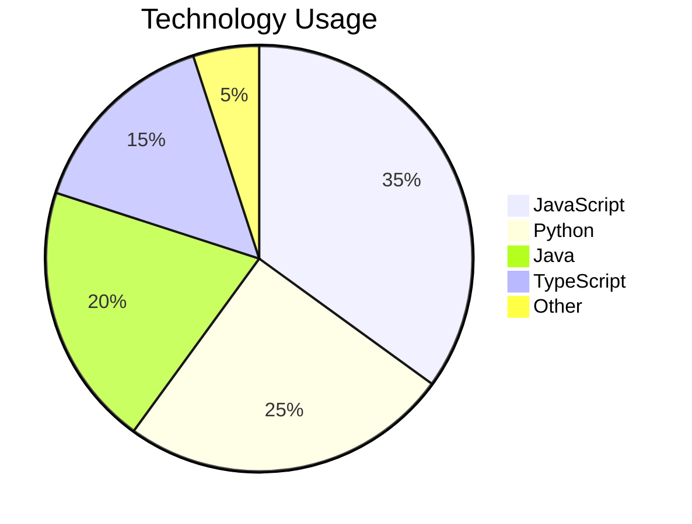
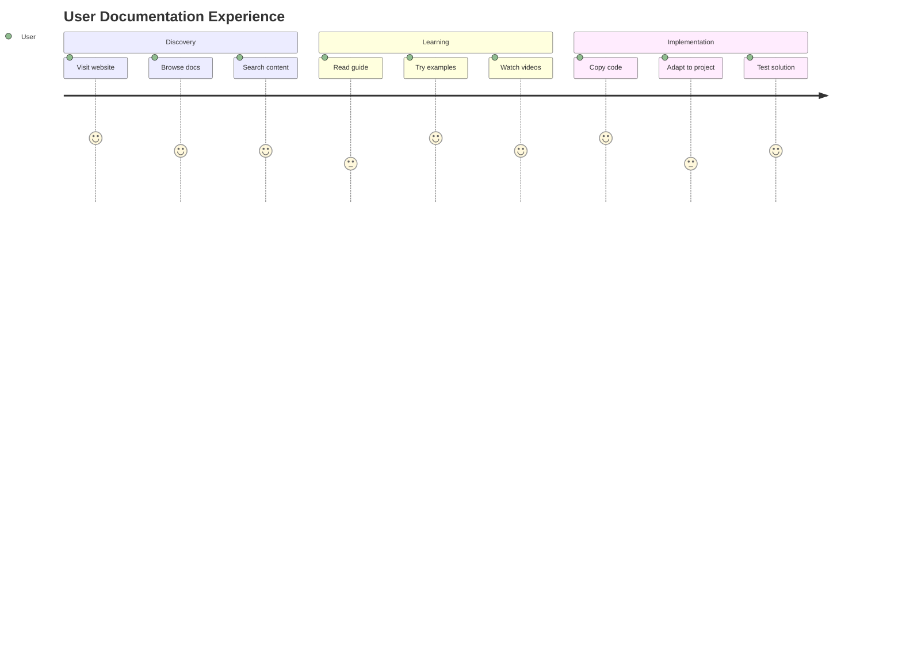

# Mermaid Diagrams

Mermaid allows you to create diagrams and flowcharts using simple text syntax.

## Configuration

To enable Mermaid in MkDocs Material, add this to your `mkdocs.yml`:

```yaml
markdown_extensions:
  - pymdownx.superfences:
      custom_fences:
        - name: mermaid
          class: mermaid
          format: !!python/name:pymdownx.superfences.fence_code_format
```

## Diagram Types

### Flowcharts



### Sequence Diagrams



### Class Diagrams



### State Diagrams



### Git Graph

```mermaid
gitgraph
    commit
    commit
    branch feature
    checkout feature
    commit
    commit
    checkout main
    commit
    merge feature
    commit
```

### Entity Relationship Diagram



### Gantt Charts



### Pie Charts



### User Journey



## Tips for Better Diagrams

!!! tip "Best Practices"
    - Keep diagrams simple and focused
    - Use descriptive labels
    - Maintain consistent styling
    - Test diagrams in different themes
    - Use appropriate diagram types for your content

!!! warning "Limitations"
    - Large diagrams may be hard to read on mobile
    - Complex diagrams can slow page loading
    - Not all Mermaid features are supported in all contexts

## Interactive Features

Mermaid diagrams in Material for MkDocs support:

- **Zooming**: Click and drag to pan, scroll to zoom
- **Theme adaptation**: Automatically adapts to light/dark theme
- **Responsive design**: Scales appropriately on different screen sizes
